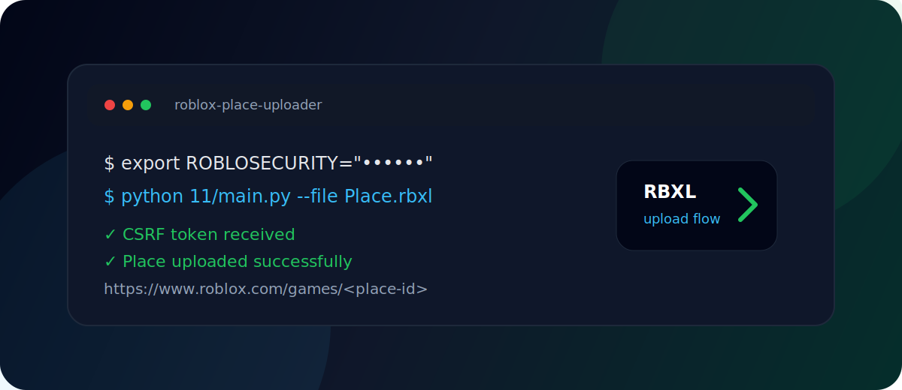

<div align="center">

# RobloxPlaceUploader

**A compact Python workflow for publishing Roblox place files from the command line.**



<br />


</div>

---

## Why This Exists

RobloxPlaceUploader is a small automation utility for uploading `.rbxl` and `.rbxlx` files while keeping the workflow easy to inspect. It is useful for quick local tests, repeatable publishing experiments, and learning how Roblox upload flows handle authentication, CSRF tokens, retries, and place IDs.

> Important: this project uses the legacy Roblox upload endpoint as a best-effort workflow. Roblox has deprecated `data.roblox.com/Data/Upload.ashx` for place publishing traffic, so Open Cloud Place Publishing API is the recommended long-term production path.

## Features

- Upload `.rbxl` and `.rbxlx` place files.
- Read `.ROBLOSECURITY` from an environment variable or explicit CLI argument.
- Request and reuse `X-CSRF-TOKEN` automatically.
- Auto-select the latest root place or target a specific `--place-id`.
- Retry temporary HTTP failures.
- Print the final Roblox game URL and optionally open it in a browser.
- Document secret-handling rules so cookies do not end up in commits.

## Quick Start

Set your Roblox cookie through an environment variable:

```bash
export ROBLOSECURITY="YOUR_COOKIE_VALUE"
python 11/main.py --file Place.rbxl
```

On Windows PowerShell:

```powershell
$env:ROBLOSECURITY = "YOUR_COOKIE_VALUE"
python 11/main.py --file Place.rbxl
```

Use an explicit place ID:

```bash
python 11/main.py --file Place.rbxl --place-id 123456789 --no-open
```

## Options

| Option | Purpose |
| --- | --- |
| `--cookie` | `.ROBLOSECURITY` value. If omitted, the script reads `ROBLOSECURITY`. |
| `--file` | Path to a `.rbxl` or `.rbxlx` file. Defaults to `Place.rbxl`. |
| `--place-id` | Optional explicit place ID. If omitted, the script selects a place automatically. |
| `--no-open` | Do not open the result URL in a browser. |
| `--timeout` | HTTP timeout in seconds. Defaults to `90`. |
| `--retries` | Retry count for temporary HTTP failures. Defaults to `2`. |

## Safety Rules

- Never commit `.ROBLOSECURITY` cookies.
- Prefer environment variables over command-line arguments so secrets are less likely to appear in shell history.
- Rotate your Roblox cookie immediately if it was pasted into logs, screenshots, commits, or chat.
- Use Open Cloud API keys for production workflows when possible.
- Only upload to Roblox experiences you own or have permission to manage.

## Repository Layout

```txt
.
├── 11/main.py       upload script
├── 11/             sample media/assets
├── docs/demo.svg   visual project preview
├── Place.rbxl      sample place file
├── README.md       project guide
└── SECURITY.md     security reporting and secret handling
```

## Roadmap

- Add Open Cloud Place Publishing API support.
- Add `.env.example` for safer local setup.
- Add dry-run validation for file paths and target place IDs.
- Split API helpers into testable modules.
- Add screenshots or short clips when a stable demo flow is available.

## Connect

- Discord: https://discord.gg/ueVWTaeZZC
- Telegram: https://t.me/killyouridolsss
- TikTok: https://www.tiktok.com/@9micedev
- GitHub: https://github.com/9micedev
